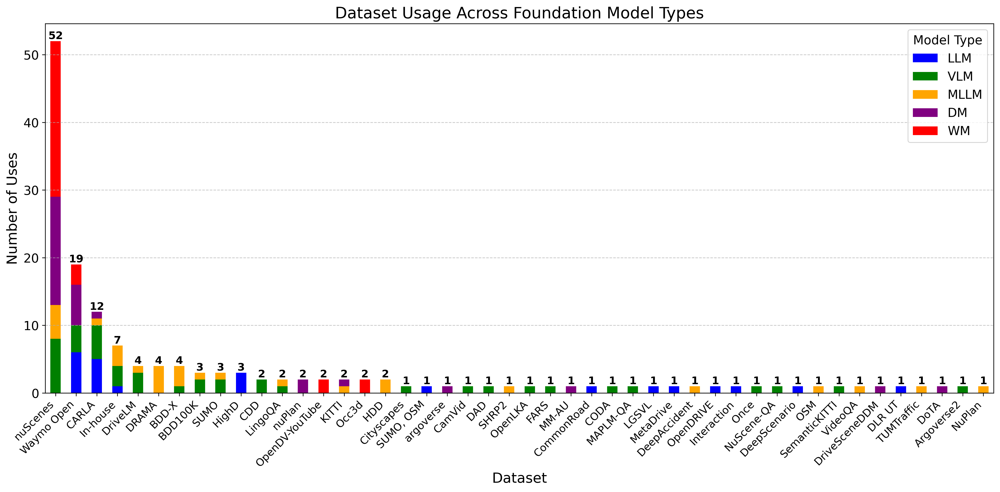
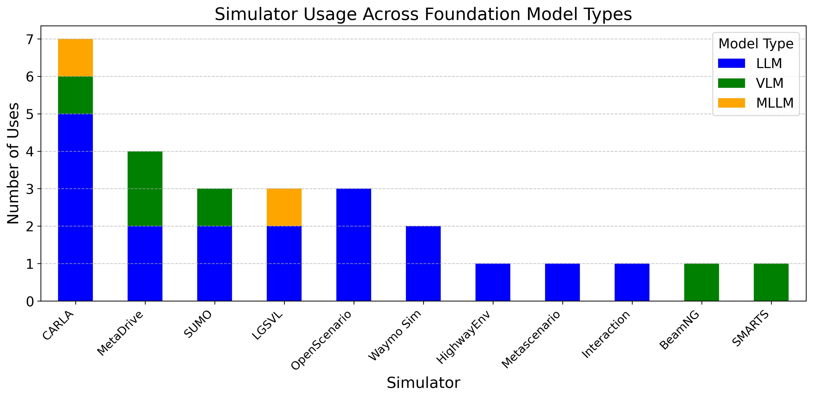

# Multi-Agent-Foundations-for-Autonomous-Driving

This repository reorganizes paper lists according to the survey outline below, with a focus on 2020-2026 works and a few classic pre-2020 foundations.

## Surveys

### Core LLM/Multi-Agent Surveys

- [2025/10] Thought Communication in Multiagent Collaboration [[paper]](https://arxiv.org/abs/2510.20733)
- [2025/07] A Survey of Multi-AI Agent Collaboration: Theories, Technologies and Applications [[paper]](https://jglobal.jst.go.jp/en/detail?JGLOBAL_ID=202502258387479496)
- [2025/04] A Survey of AI Agent Protocols [[paper]](https://arxiv.org/abs/2504.16736)
- [2025/03] Large Language Model Agent: A Survey on Methodology, Applications and Challenges [[paper]](https://arxiv.org/abs/2503.21460)
- [2025/02] Beyond Self-Talk: A Communication-Centric Survey of LLM-Based Multi-Agent Systems [[paper]](https://arxiv.org/abs/2502.14321)
- [2025/01] Multi-Agent Collaboration Mechanisms: A Survey of LLMs [[paper]](https://arxiv.org/abs/2501.06322)
- [2025/xx] Multi-Agent Coordination across Diverse Applications: A Survey [[paper]](https://api.semanticscholar.org/CorpusId:276482652)
- [2024/12] A Survey on LLM-based Multi-Agent System: Recent Advances and New Frontiers in Application [[paper]](https://arxiv.org/abs/2412.17481)
- [2024/10] A Survey on LLM-based Multi-Agent Systems: Workflow, Infrastructure, and Challenges [[paper]](https://api.semanticscholar.org/CorpusId:273218743)
- [2024/07] Merge, Ensemble, and Cooperate! A Survey on Collaborative Strategies in the Era of Large Language Models [[paper]](https://arxiv.org/abs/2407.06089)
- [2024/05] LLM-based Multi-Agent Reinforcement Learning: Current and Future Directions [[paper]](https://arxiv.org/abs/2405.11106)
- [2024/02] Large Language Model based Multi-Agents: A Survey of Progress and Challenges [[paper]](https://arxiv.org/abs/2402.01680)
- [2024/01] Exploring Large Language Model based Intelligent Agents: Definitions, Methods, and Prospects [[paper]](https://arxiv.org/abs/2401.03428)
- [2024/xx] The Role of Multi-Agents in Digital Twin Implementation: Short Survey [[paper]](https://doi.org/10.1145/3697350)

### Autonomous Driving-Oriented Surveys

- [2025/12] Vision-Language-Action Models for Autonomous Driving: Past, Present, and Future [[paper]](https://arxiv.org/abs/2512.16760)
- [2025/06] Foundation Models in Autonomous Driving: A Survey on Scenario Generation and Scenario Analysis [[paper]](https://arxiv.org/abs/2506.11526)
- [2025/02] Multi-Agent Autonomous Driving Systems with Large Language Models: A Survey of Recent Advances [[paper]](https://arxiv.org/abs/2502.16804)
- [2025/02] The Role of World Models in Shaping Autonomous Driving: A Comprehensive Survey [[paper]](https://arxiv.org/abs/2502.10498)
- [2025/01] A Survey of World Models for Autonomous Driving [[paper]](https://arxiv.org/abs/2501.11260)
- [2024/03] World Models for Autonomous Driving: An Initial Survey [[paper]](https://arxiv.org/abs/2403.02622)
- [2023/11] LLM4Drive: A Survey of Large Language Models for Autonomous Driving [[paper]](https://arxiv.org/abs/2311.01043)
- [2023/11] A Survey on Multimodal Large Language Models for Autonomous Driving [[paper]](https://arxiv.org/abs/2311.12320)
- [2023/10] Vision Language Models in Autonomous Driving: A Survey and Outlook [[paper]](https://arxiv.org/abs/2310.14414)

---

## Single-Agent Foundation-Model Agents for Autonomous Driving

### Foundation Model as Driving Controllers

#### LLM-based high-level planning and reasoning

- [2025/12] OpenREAD: Reinforced Open-Ended Reasoning for End-to-End Autonomous Driving with LLM-as-Critic [[paper]](https://arxiv.org/abs/2512.01830)
- [2025/10] BEVDriver: Leveraging BEV Maps in LLMs for Robust Closed-Loop Driving [[paper]](https://arxiv.org/abs/2503.03074)
- [2025/06] Drive-R1: Bridging Reasoning and Planning in VLMs for Autonomous Driving with Reinforcement Learning [[paper]](https://arxiv.org/abs/2506.18234)
- [2025/02] Hybrid-Driving: An Autonomous Driving Decision Framework Integrating LLMs, Knowledge Graphs and Driving Rules [[paper]](https://ojs.aaai.org/index.php/AAAI/article/view/32066)
- [2024/10] Agent-Driver: A Language Agent for Autonomous Driving [[paper]](https://arxiv.org/abs/2311.10813)
- [2024/08] VLM-MPC: VLM-Guided Model Predictive Controller for Autonomous Driving [[paper]](https://arxiv.org/abs/2408.04821)
- [2024/08] Edge-Cloud Collaborative Motion Planning for Autonomous Driving with LLMs [[paper]](https://arxiv.org/abs/2408.09972)
- [2024/06] Driving Everywhere with Large Language Model Policy Adaptation [[paper]](https://arxiv.org/abs/2402.05932)
- [2024/06] PlanAgent: A Multi-modal Large Language Agent for Closed-loop Vehicle Motion Planning [[paper]](https://arxiv.org/abs/2406.01587)
- [2024/06] Asynchronous Large Language Model Enhanced Planner for Autonomous Driving [[paper]](https://arxiv.org/abs/2406.14556)
- [2024/05] Driving with LLMs: Fusing Object-Level Vector Modality for Explainable Autonomous Driving [[paper]](https://ieeexplore.ieee.org/abstract/document/10611018)
- [2024/05] DiLu: A Knowledge-Driven Approach to Autonomous Driving with Large Language Models [[paper]](https://arxiv.org/abs/2309.16292)
- [2023/12] LLM-Assist: Enhancing Closed-Loop Planning with Language-Based Reasoning [[paper]](https://arxiv.org/abs/2401.00125)
- [2023/10] LanguageMPC: Large Language Models as Decision Makers for Autonomous Driving [[paper]](https://arxiv.org/abs/2310.03026)
- [2023/10] DriveGPT4: Interpretable End-to-end Autonomous Driving via Large Language Model [[paper]](https://arxiv.org/abs/2310.01412)
- [2023/09] TrafficGPT: Viewing, Processing and Interacting with Traffic Foundation Models [[paper]](https://arxiv.org/abs/2309.06719)

#### VLM/MLLM-based driving agents

- [2025/09] DriveAgent-R1: Advancing VLM-Based AD with Hybrid Thinking and Active Perception [[paper]](https://arxiv.org/abs/2507.20879)
- [2025/06] FutureSightDrive: Thinking Visually with Spatio-Temporal CoT for AD [[paper]](https://arxiv.org/abs/2505.17685)
- [2025/05] SURDS: Benchmarking Spatial Understanding and Reasoning in Driving Scenarios with VLMs [[paper]](https://arxiv.org/abs/2411.13112)
- [2025/05] OmniDrive: A Holistic Vision-Language Dataset for Autonomous Driving with Counterfactual Reasoning [[paper]](https://arxiv.org/abs/2405.01533)
- [2025/03] HiLM-D: Enhancing MLLMs with Multi-Scale High-Resolution Details for Autonomous Driving [[paper]](https://arxiv.org/abs/2309.05186)
- [2025/03] DriveLMM-o1: A Step-by-Step Reasoning Dataset and Large Multimodal Model [[paper]](https://arxiv.org/abs/2503.10621)
- [2025/01] DriveBench: Are VLMs Ready for Autonomous Driving? [[paper]](https://arxiv.org/abs/2501.04003)
- [2024/10] VLM-Auto: VLM-based Autonomous Driving Assistant with Human-like Behavior [[paper]](https://arxiv.org/abs/2405.05885)
- [2024/09] Think-Driver: From Driving-Scene Understanding to Decision-Making with VLMs [[paper]](https://mllmav.github.io/papers/Think-Driver:%20From%20Driving-Scene%20Understanding%20to%20Decision-Making%20with%20Vision%20Language%20Models.pdf)
- [2024/06] DriVLMe: Enhancing LLM-based Autonomous Driving Agents with Embodied and Social Experiences [[paper]](https://arxiv.org/abs/2406.03008)
- [2024/06] Reason2Drive: Towards Interpretable and Chain-based Reasoning for Autonomous Driving [[paper]](https://arxiv.org/abs/2312.03661)
- [2024/05] RAG-Driver: Generalisable Driving Explanations with Retrieval-Augmented In-Context Learning [[paper]](https://arxiv.org/abs/2402.10828)
- [2024/02] DriveVLM: The Convergence of Autonomous Driving and Large Vision-Language Models [[paper]](https://arxiv.org/abs/2402.12289)
- [2024/01] VLP: Vision Language Planning for Autonomous Driving [[paper]](https://arxiv.org/abs/2401.05577)
- [2024/01] Holistic Autonomous Driving Understanding by BEV-Injected Multi-Modal Large Models [[paper]](https://arxiv.org/abs/2401.00988)
- [2023/12] DriveLM: Driving with Graph Visual Question Answering [[paper]](https://arxiv.org/abs/2312.14150)
- [2023/12] Dolphins: Multimodal Language Model for Driving [[paper]](https://arxiv.org/abs/2312.00438)
- [2023/11] On the Road with GPT-4V(ision): Early Explorations of VLM on Autonomous Driving [[paper]](https://arxiv.org/abs/2311.05332)
- [2023/10] DriveGPT4: Interpretable End-to-end Autonomous Driving via Large Language Model [[paper]](https://arxiv.org/abs/2310.01412)

#### VLA and end-to-end driving policies

- [2026/04] UniDriveVLA: Unifying Understanding, Perception, and Action Planning for Autonomous Driving [[paper]](https://arxiv.org/abs/2604.02190)
- [2026/04] Causal Scene Narration with Runtime Safety Supervision for Vision-Language-Action Driving [[paper]](https://arxiv.org/abs/2604.01723)
- [2026/03] Uni-World VLA: Interleaved World Modeling and Planning for Autonomous Driving [[paper]](https://arxiv.org/abs/2603.27287)
- [2026/03] Drive My Way: Preference Alignment of Vision-Language-Action Model for Personalized Driving [[paper]](https://arxiv.org/abs/2603.25740)
- [2026/03] ETA-VLA: Efficient Token Adaptation for Vision-Language-Action Models [[paper]](https://arxiv.org/abs/2603.25766)
- [2026/03] AutoMoT: A Unified VLA Model with Asynchronous Mixture-of-Transformers for End-to-End AD [[paper]](https://arxiv.org/abs/2603.14851)
- [2026/03] DynVLA: Learning World Dynamics for Action Reasoning in Autonomous Driving [[paper]](https://arxiv.org/abs/2603.11041)
- [2026/03] StyleVLA: Driving Style-Aware Vision Language Action Model for Autonomous Driving [[paper]](https://arxiv.org/abs/2603.09482)
- [2026/03] SAMoE-VLA: A Scene Adaptive Mixture-of-Experts VLA Model for Autonomous Driving [[paper]](https://arxiv.org/abs/2603.08113)
- [2026/03] LinkVLA: Unifying Language-Action Understanding and Generation for Autonomous Driving [[paper]](https://arxiv.org/abs/2603.01441)
- [2026/03] LaST-VLA: Thinking in Latent Spatio-Temporal Space for VLA in Autonomous Driving [[paper]](https://arxiv.org/abs/2603.01928)
- [2026/03] ELF-VLA: Unleashing VLA Potentials in Autonomous Driving via Explicit Learning from Failures [[paper]](https://arxiv.org/abs/2603.01063)
- [2026/02] NoRD: A Data-Efficient VLA Model that Drives without Reasoning [[paper]](https://arxiv.org/abs/2602.21172)
- [2026/02] HiST-VLA: A Hierarchical Spatio-Temporal VLA Model for End-to-End AD [[paper]](https://arxiv.org/abs/2602.13329)
- [2026/02] SteerVLA: Steering Vision-Language-Action Models in Long-Tail Driving Scenarios [[paper]](https://arxiv.org/abs/2602.08440)
- [2026/02] DriveWorld-VLA: Unified Latent-Space World Modeling with VLA for Autonomous Driving [[paper]](https://arxiv.org/abs/2602.06521)
- [2026/01] LatentVLA: Efficient Vision-Language Models for Autonomous Driving via Latent Action Prediction [[paper]](https://arxiv.org/abs/2601.05611)
- [2025/12] ColaVLA: Leveraging Cognitive Latent Reasoning for Hierarchical Parallel Trajectory Planning [[paper]](https://arxiv.org/abs/2512.22939)
- [2025/12] FutureX: Enhance End-to-End Autonomous Driving via Latent Chain-of-Thought World Model [[paper]](https://arxiv.org/abs/2512.11226)
- [2025/12] Latent Chain-of-Thought World Modeling for End-to-End Driving [[paper]](https://arxiv.org/abs/2512.10226)
- [2025/08] EMMA: End-to-End Multimodal Model for Autonomous Driving [[paper]](https://arxiv.org/abs/2410.23262)
- [2025/07] FastDriveVLA: Efficient End-to-End Driving via Reconstruction-Based Token Pruning [[paper]](https://arxiv.org/abs/2507.23318)
- [2025/07] ReAL-AD: Towards Human-Like Reasoning in End-to-End Autonomous Driving [[paper]](https://arxiv.org/abs/2507.12499)
- [2025/06] AutoVLA: A Vision-Language-Action Model for End-to-End AD [[paper]](https://arxiv.org/abs/2506.13757)
- [2025/06] DriveGPT4-V2: Harnessing LLM Capabilities for Enhanced Closed-Loop Autonomous Driving [[paper]](https://openaccess.thecvf.com/content/CVPR2025/papers/Xu_DriveGPT4-V2_Harnessing_Large_Language_Model_Capabilities_for_Enhanced_Closed-Loop_Autonomous_CVPR_2025_paper.pdf)
- [2025/06] ReCogDrive: A Reinforced Cognitive Framework for End-to-End Autonomous Driving [[paper]](https://arxiv.org/abs/2506.08052)
- [2025/05] Impromptu VLA: Open Weights and Open Data for Driving Vision-Language-Action Models [[paper]](https://arxiv.org/abs/2505.23757)
- [2025/05] SOLVE: Synergy of Language-Vision and End-to-End Networks for Autonomous Driving [[paper]](https://arxiv.org/abs/2505.16805)
- [2025/05] DriveMoE: Mixture-of-Experts for VLA in End-to-End AD [[paper]](https://arxiv.org/abs/2505.16278)
- [2025/03] OpenDriveVLA: Towards End-to-end Autonomous Driving with Large Vision Language Action Model [[paper]](https://arxiv.org/abs/2503.23463)
- [2025/03] ORION: End-to-End AD by Vision-Language Instructed Action Generation [[paper]](https://arxiv.org/abs/2503.19755)
- [2025/03] SimLingo: Vision-Only Closed-Loop AD with Language-Action Alignment [[paper]](https://arxiv.org/abs/2503.09594)
- [2025/02] Sce2DriveX: A Generalized MLLM Framework for Scene-to-Drive Learning [[paper]](https://arxiv.org/abs/2502.14917)
- [2024/12] VLM-AD: End-to-End Autonomous Driving through Vision-Language Model Supervision [[paper]](https://arxiv.org/abs/2412.14446)
- [2024/12] OpenEMMA: Open-Source Multimodal Model for End-to-End Autonomous Driving [[paper]](https://arxiv.org/abs/2412.15208)
- [2024/10] Senna: Bridging Large Vision-Language Models and End-to-End Autonomous Driving [[paper]](https://arxiv.org/abs/2410.22313)
- [2024/08] CoVLA: Comprehensive Vision-Language-Action Dataset for Autonomous Driving [[paper]](https://arxiv.org/abs/2408.10845)
- [2024/03] VLAAD: Vision and Language Assistant for Autonomous Driving [[paper]](https://openaccess.thecvf.com/content/WACV2024W/LLVM-AD/papers/Park_VLAAD_Vision_and_Language_Assistant_for_Autonomous_Driving_WACVW_2024_paper.pdf)
- [2023/12] LMDrive: Closed-Loop End-to-End Driving with Large Language Models [[paper]](https://arxiv.org/abs/2312.07488)

#### Diffusion-based trajectory planning and policy generation

- [2026/02] MVLAD-AD: Efficient and Explainable End-to-End AD via Masked VLA Diffusion [[paper]](https://arxiv.org/abs/2602.20577)
- [2026/02] DriveFine: Refining-Augmented Masked Diffusion VLA for Precise and Robust Driving [[paper]](https://arxiv.org/abs/2602.14577)
- [2026/01] Dichotomous Diffusion Policy Optimization [[paper]](https://arxiv.org/abs/2601.00898)
- [2025/12] WAM-Diff: A Masked Diffusion VLA Framework with MoE and Online RL for AD [[paper]](https://arxiv.org/abs/2512.11872)
- [2025/12] DiffusionDriveV2: Reinforcement Learning-Constrained Truncated Diffusion Modeling in End-to-End Autonomous Driving [[paper]](https://arxiv.org/abs/2512.07745)
- [2025/12] Mimir: Hierarchical Goal-Driven Diffusion with Uncertainty Propagation for End-to-End Autonomous Driving [[paper]](https://arxiv.org/abs/2512.07130)
- [2025/12] dVLM-AD: Enhance Diffusion Vision-Language-Model for Driving via Controllable Reasoning [[paper]](https://arxiv.org/abs/2512.04459)
- [2025/11] GuideFlow: Constraint-Guided Flow Matching for Planning in End-to-End Autonomous Driving [[paper]](https://arxiv.org/abs/2511.18729)
- [2025/10] DiffVLA++: Bridging Cognitive Reasoning and End-to-End Driving through Metric-Guided Alignment [[paper]](https://arxiv.org/abs/2510.17148)
- [2025/10] VDRive: Leveraging Reinforced VLA and Diffusion Policy for End-to-End Autonomous Driving [[paper]](https://arxiv.org/abs/2510.15446)
- [2025/10] Flow Matching-Based Autonomous Driving Planning with Advanced Interactive Behavior Modeling [[paper]](https://arxiv.org/abs/2510.11083)
- [2025/09] ReflectDrive: Discrete Diffusion for Reflective VLA in AD [[paper]](https://arxiv.org/abs/2509.20109)
- [2025/09] A Knowledge-Driven Diffusion Policy for End-to-End Autonomous Driving Based on Expert Routing [[paper]](https://arxiv.org/abs/2509.04853)
- [2025/08] Drive As You Like: Strategy-Level Motion Planning Based on a Multi-Head Diffusion Model [[paper]](https://arxiv.org/abs/2508.16947)
- [2025/08] ViLaD: A Large Vision Language Diffusion Framework for End-to-End Autonomous Driving [[paper]](https://arxiv.org/abs/2508.12603)
- [2025/06] Epona: Autoregressive Diffusion World Model for Autonomous Driving [[paper]](https://arxiv.org/abs/2506.24113)
- [2025/05] DiffVLA: Vision-Language Guided Diffusion Planning for Autonomous Driving [[paper]](https://arxiv.org/abs/2505.19381)
- [2025/05] DiffE2E: Rethinking End-to-End Driving with a Hybrid Action Diffusion and Supervised Policy [[paper]](https://arxiv.org/abs/2505.19516)
- [2025/03] GoalFlow: Goal-Driven Flow Matching for Multimodal Trajectories Generation in End-to-End AD [[paper]](https://arxiv.org/abs/2503.05689)
- [2025/03] DiffAD: A Unified Diffusion Modeling Approach for Autonomous Driving [[paper]](https://arxiv.org/abs/2503.12170)
- [2024/11] DiffusionDrive: Truncated Diffusion Model for End-to-End Autonomous Driving [[paper]](https://arxiv.org/abs/2411.15139)
- [2024/11] Imagine-2-Drive: Leveraging High-Fidelity World Models via Multi-Modal Diffusion Policies [[paper]](https://arxiv.org/abs/2411.10171)
- [2024/07] GUMP: Solving Motion Planning Tasks with a Scalable Generative Model [[paper]](https://arxiv.org/abs/2407.02797)
- [2024/02] GenAD: Generative End-to-End Autonomous Driving [[paper]](https://arxiv.org/abs/2402.11502)

#### World-model-enhanced planning and policy learning

- [2026/01] UniDrive-WM: Unified Understanding, Planning and Generation World Model For Autonomous Driving [[paper]](https://arxiv.org/abs/2601.04453)
- [2025/06] ReSim: Reliable World Simulation for Autonomous Driving [[paper]](https://arxiv.org/abs/2506.09981)
- [2025/03] GAIA-2: A Controllable Multi-View Generative World Model for AD [[paper]](https://arxiv.org/abs/2503.20523)
- [2025/02] VaViM and VaVAM: Autonomous Driving through Video Generative Modeling [[paper]](https://arxiv.org/abs/2502.15672)
- [2024/12] DrivingWorld: Constructing World Model for AD via Video GPT [[paper]](https://arxiv.org/abs/2412.19505)
- [2024/12] DrivingGPT: Unifying Driving World Modeling and Planning with Multi-Modal Autoregressive Transformers [[paper]](https://arxiv.org/abs/2412.18607)
- [2024/12] Doe-1: Closed-Loop Autonomous Driving with Large World Model [[paper]](https://arxiv.org/abs/2412.09627)
- [2024/11] DriveDreamer4D: World Models as Effective Data Machines [[paper]](https://arxiv.org/abs/2410.13571)
- [2024/05] DriveDreamer-2: LLM-Enhanced World Models for Diverse Driving Video Generation [[paper]](https://arxiv.org/abs/2403.06845)
- [2024/03] Vista: A Generalizable Driving World Model with High Fidelity and Controllability [[paper]](https://arxiv.org/abs/2405.17398)
- [2023/09] DriveDreamer: Towards Real-world-driven World Models for AD [[paper]](https://arxiv.org/abs/2309.09777)
- [2023/09] GAIA-1: A Generative World Model for Autonomous Driving [[paper]](https://arxiv.org/abs/2309.17080)

### Foundation Models as Scenario Generators and Test Agents

#### Language- and knowledge-guided scenario specification

- Rule/report/test-intent to logical scenarios:
  - [2025/09] Txt2Sce: Scenario Generation for AD System Testing Based on Textual Reports [[paper]](https://arxiv.org/abs/2509.02150)
  - [2025/03] Text2Scenario: Text-Driven Scenario Generation for AD Test [[paper]](https://arxiv.org/abs/2503.02911)
  - [2024/09] LeGEND: Top-Down Scenario Generation Assisted by LLMs [[paper]](https://arxiv.org/abs/2409.10066)
  - [2024/09] SoVAR: Generalizable Scenarios from Accident Reports [[paper]](https://arxiv.org/abs/2409.08081)
  - [2023/05] TARGET: Automated Scenario Generation from Traffic Rules for Testing AVs [[paper]](https://arxiv.org/abs/2305.06018)
- Language-to-simulator and editable scenario construction:
  - [2025/10] LinguaSim: Interactive Multi-Vehicle Testing Scenario Generation [[paper]](https://arxiv.org/abs/2510.08046)
  - [2025/06] Talk2Traffic: Interactive and Editable Traffic Scenario Generation with MLLMs [[paper]](https://openaccess.thecvf.com/content/CVPR2025W/WDFM-AD/html/Sheng_Talk2Traffic_Interactive_and_Editable_Traffic_Scenario_Generation_for_Autonomous_Driving_CVPRW_2025_paper.html)
  - [2024/11] ChatSUMO: LLM for Automating Traffic Scenario Generation in SUMO [[paper]](https://arxiv.org/abs/2409.09040)
  - [2024/06] Chat2Scenario: Scenario Extraction from Dataset via LLM [[paper]](https://arxiv.org/abs/2404.16147)
  - [2024/06] ChatSim: Editable Scene Simulation via Collaborative LLM-Agents [[paper]](https://arxiv.org/abs/2402.05746)
  - [2024/05] ChatScene: Knowledge-Enabled Safety-Critical Scenario Generation [[paper]](https://arxiv.org/abs/2405.14062)
- Language-conditioned traffic distributions:
  - [2025/06] Multi-modal Traffic Scenario Generation for AD System Testing [[paper]](https://arxiv.org/abs/2505.14881)
  - [2025/02] CurricuVLM: Personalized Safety-Critical Curriculum Learning with VLMs [[paper]](https://arxiv.org/abs/2502.15119)
  - [2024/12] AutoSceneGen: In-Context Traffic Scenario Generation for Motion Planners [[paper]](https://arxiv.org/abs/2412.18086)
  - [2024/11] Generating Out-of-Distribution Scenarios Using Language Models [[paper]](https://arxiv.org/abs/2411.16554)
  - [2024/09] ProSim: Promptable Closed-Loop Traffic Simulation [[paper]](https://arxiv.org/abs/2409.05863)
  - [2023/07] Language Conditioned Traffic Generation [[paper]](https://arxiv.org/abs/2307.07947)

#### Generative scenario synthesis with VLMs, diffusion models, and world models

- Traffic-agent, trajectory, and vectorized scene generation:
  - [2025/03] Scenario Dreamer: Vectorized Latent Diffusion for Driving Simulation Environments [[paper]](https://arxiv.org/abs/2503.22496)
  - [2025/02] CCDiff: Causal Composition Diffusion for Closed-Loop Traffic Generation [[paper]](https://arxiv.org/abs/2412.17920)
  - [2024/12] SceneDiffuser: Efficient and Controllable Driving Simulation Initialization and Rollout [[paper]](https://arxiv.org/abs/2412.12129)
  - [2024/04] VBD: Versatile Behavior Diffusion for Generalized Traffic Agent Simulation [[paper]](https://arxiv.org/abs/2404.02524)
  - [2023/11] Scenario Diffusion: Controllable Driving Scenario Generation with Diffusion [[paper]](https://arxiv.org/abs/2311.02738)
  - [2023/10] CTG: Guided Conditional Diffusion for Controllable Traffic Simulation [[paper]](https://arxiv.org/abs/2210.17366)
  - [2023/10] TrafficGen: Diverse and Realistic Traffic Scenarios [[paper]](https://arxiv.org/abs/2210.06609)
- Street-view, multi-view, video, and 3D-aware generation:
  - [2025/08] HERMES: Unified Self-Driving World Model for 3D Understanding and Generation [[paper]](https://arxiv.org/abs/2501.14729)
  - [2025/06] Epona: Autoregressive Diffusion World Model for AD [[paper]](https://arxiv.org/abs/2506.24113)
  - [2024/11] MagicDrive-V2: High-Resolution Long Video Generation for AD [[paper]](https://arxiv.org/abs/2411.13807)
  - [2024/08] Panacea+: Panoramic and Controllable Video Generation for AD [[paper]](https://arxiv.org/abs/2408.07605)
  - [2024/07] SLEDGE: Generative Driving Environments and Rule-Based Traffic [[paper]](https://arxiv.org/abs/2403.17933)
  - [2023/11] Panacea: Panoramic and Controllable Video Generation for AD [[paper]](https://arxiv.org/abs/2311.16813)
  - [2023/10] DrivingDiffusion: Layout-Guided Multi-View Driving Scene Video Generation [[paper]](https://arxiv.org/abs/2310.07771)
  - [2023/10] MagicDrive: Street View Generation with 3D Geometry Control [[paper]](https://arxiv.org/abs/2310.02601)
- Multimodal and world-model interactive synthesis:
  - [2025/06] ReSim: Reliable World Simulation for AD [[paper]](https://arxiv.org/abs/2506.09981)
  - [2025/05] CrashAgent: Crash Scenario Generation via Multi-Modal Reasoning [[paper]](https://arxiv.org/abs/2505.18341)
  - [2025/03] GAIA-2: Controllable Multi-View Generative World Model [[paper]](https://arxiv.org/abs/2503.20523)
  - [2024/03] Vista: Generalizable Driving World Model with High Fidelity and Controllability [[paper]](https://arxiv.org/abs/2405.17398)
  - [2023/09] DriveDreamer: Real-World-Driven World Models for AD [[paper]](https://arxiv.org/abs/2309.09777)
  - [2023/09] GAIA-1: A Generative World Model for AD [[paper]](https://arxiv.org/abs/2309.17080)

#### Closed-loop adversarial and safety-critical scenario generation

- Optimization and adversarial-search foundations:
  - [2024/01] SAFE-SIM: Safety-Critical Closed-Loop Traffic Simulation with Diffusion-Controllable Adversaries [[paper]](https://arxiv.org/abs/2401.00391)
  - [2022/04] KING: Safety-Critical Driving Scenarios via Kinematics Gradients [[paper]](https://arxiv.org/abs/2204.13683)
  - [2021/03] AdvSim: Generating Safety-Critical Scenarios for Self-Driving Vehicles [[paper]](https://openaccess.thecvf.com/content/CVPR2021/html/Wang_AdvSim_Generating_Safety-Critical_Scenarios_for_Self-Driving_Vehicles_CVPR_2021_paper.html)
  - [2020/03] Learning to Collide: Adaptive Safety-Critical Scenario Generation [[paper]](https://arxiv.org/abs/2003.01197)
- LLM/VLM-guided adversarial scenario search:
  - [2025/08] Adversarial Generation and Collaborative Evolution of Safety-Critical Scenarios [[paper]](https://arxiv.org/abs/2508.14527)
  - [2025/07] AGENTS-LLM: Agentic Generation of Challenging Traffic Scenarios [[paper]](https://arxiv.org/abs/2507.13729)
  - [2025/05] Seeking to Collide: Online Safety-Critical Generation with RAG-LLM [[paper]](https://arxiv.org/abs/2505.00972)
  - [2025/02] From Words to Collisions: LLM-Guided Evaluation and Adversarial Generation [[paper]](https://arxiv.org/abs/2502.02145)
  - [2025/01] LLM-attacker: Closed-Loop Adversarial Scenario Generation for AD [[paper]](https://arxiv.org/abs/2501.15850)
- Diffusion/world-model adversarial regeneration:
  - [2026/03] AnchorDrive: LLM Scenario Rollout with Anchor-Guided Diffusion Regeneration [[paper]](https://arxiv.org/abs/2603.02542)
  - [2025/12] VLM as Strategist: Adaptive Safety-Critical Testing via Guided Diffusion [[paper]](https://arxiv.org/abs/2512.02844)
  - [2025/05] LD-Scene: LLM-Guided Diffusion for Adversarial Safety-Critical Scenarios [[paper]](https://arxiv.org/abs/2505.11247)
  - [2024/10] AdvDiffuser: Adversarial Safety-Critical Driving Scenarios via Guided Diffusion [[paper]](https://arxiv.org/abs/2410.08453)

#### Foundation-model test agents for evaluation and failure explanation

- Realism, anomaly, risk, and explanation:
  - [2026/02] DRIV-EX: Counterfactual Explanations for Driving LLMs [[paper]](https://arxiv.org/abs/2603.00696)
  - [2025/07] SafeDriveRAG: Safe AD with Knowledge-Graph Retrieval-Augmented Generation [[paper]](https://arxiv.org/abs/2507.21585)
  - [2025/03] Comprehensive LLM-Powered Framework for Driving Intelligence Evaluation [[paper]](https://arxiv.org/abs/2503.05164)
  - [2024/03] Reality Bites: Assessing Realism of Driving Scenarios with LLMs [[paper]](https://arxiv.org/abs/2403.09906)
  - [2023/12] AccidentGPT: Accident Analysis and Prevention from V2X Perception [[paper]](https://arxiv.org/abs/2312.13156)
  - [2023/09] Semantic Anomaly Detection with Large Language Models [[paper]](https://arxiv.org/abs/2305.11307)
- Scenario-understanding and reasoning benchmarks:
  - [2026/01] Drive-P2D: Progressive Perception-to-Decision Benchmark for VLMs [[paper]](https://arxiv.org/abs/2601.14702)
  - [2025/11] RoadBench: Fine-Grained Urban Road Reasoning for MLLMs [[paper]](https://arxiv.org/abs/2511.18011)
  - [2025/10] STRIDE-QA: Spatiotemporal Reasoning in Urban Driving Scenes [[paper]](https://arxiv.org/abs/2508.10427)
  - [2025/06] STSBench: Spatio-Temporal Scenario Benchmark for MLLMs [[paper]](https://arxiv.org/abs/2506.06218)
  - [2025/05] SURDS: Spatial Understanding and Reasoning in Driving Scenarios [[paper]](https://arxiv.org/abs/2411.13112)
  - [2025/03] NuPlanQA: Multi-View Driving Scene Understanding Benchmark [[paper]](https://arxiv.org/abs/2503.12772)
  - [2025/03] VLADBench: Fine-Grained Evaluation of LVLMs in AD [[paper]](https://arxiv.org/abs/2503.21505)
  - [2025/02] TUMTraffic-VideoQA: Spatio-Temporal Traffic Video Understanding [[paper]](https://arxiv.org/abs/2502.02449)
  - [2025/01] DriveBench: Are VLMs Ready for Autonomous Driving? [[paper]](https://arxiv.org/abs/2501.04003)
  - [2024/05] OmniDrive: Holistic Vision-Language Dataset with Counterfactual Reasoning [[paper]](https://arxiv.org/abs/2405.01533)
  - [2023/12] DriveLM: Driving with Graph Visual Question Answering [[paper]](https://arxiv.org/abs/2312.14150)
- Agentic and closed-loop evaluation:
  - [2026/03] Probing the Reliability of Driving VLMs: Inconsistent Responses to Grounded Temporal Reasoning [[paper]](https://arxiv.org/abs/2603.09512)
  - [2026/01] AgentDrive: Agentic AI Reasoning with LLM-Generated Scenarios [[paper]](https://arxiv.org/abs/2601.16964)
  - [2025/10] More Than Meets the Eye? Reasoning-Planning Disconnect in VLM Driving Models [[paper]](https://arxiv.org/abs/2510.04532)
  - [2025/08] Bench2ADVLM: Closed-Loop Benchmark for VLMs in AD [[paper]](https://arxiv.org/abs/2508.02028)
  - [2024/05] Probing Multimodal LLMs as World Models for Driving [[paper]](https://arxiv.org/abs/2405.05956)

## Multi-Agent Traffic Intelligence for Autonomous Driving

### General Design Dimensions of Multi-Agent Driving Intelligence

#### Collaboration regimes: cooperative / strategic / mixed-motive

- [2026/04] V2X-QA: Ego, infrastructure, and cooperative-view reasoning benchmark [[paper]](https://arxiv.org/abs/2604.02710)
- [2025/09] V2V-GoT: V2V cooperative driving with graph-of-thought reasoning [[paper]](https://arxiv.org/abs/2509.18053)
- [2025/02] V2V-LLM: Vehicle-to-vehicle cooperative driving with multimodal LLMs [[paper]](https://arxiv.org/abs/2502.09980)
- [2025/03] CoLMDriver: LLM-based negotiation benefits cooperative autonomous driving [[paper]](https://arxiv.org/abs/2503.08683)
- [2024/09] CoDrivingLLM: Interactive and learnable cooperative driving automation [[paper]](https://arxiv.org/abs/2409.12812)
- [2024/08] AgentsCoMerge: LLM-empowered collaborative decision making for ramp merging [[paper]](https://arxiv.org/abs/2408.03624)
- [2024/07] KoMA: Knowledge-driven multi-agent framework for autonomous driving [[paper]](https://arxiv.org/abs/2407.14239)
- [2024/04] AgentsCoDriver: Collaborative driving with lifelong learning [[paper]](https://arxiv.org/abs/2404.06345)
- [2022/06] Nocturne: Real-world multi-agent driving benchmark [[paper]](https://arxiv.org/abs/2206.09889)
- [2020/10] SMARTS: Scalable multi-agent RL training school for autonomous driving [[paper]](https://arxiv.org/abs/2010.09776)
- [2017/10] Flow: Mixed-autonomy traffic framework [[paper]](https://arxiv.org/abs/1710.05465)
- [2017/06] MADDPG: Multi-agent actor-critic for mixed cooperative-competitive environments [[paper]](https://arxiv.org/abs/1706.02275)

#### Organization structures: centralized / hierarchical / distributed

- [2025/11] FLAD: Federated learning for LLM-based AD in vehicle-edge-cloud networks [[paper]](https://arxiv.org/abs/2511.09025)
- [2025/09] OGR: VLM-based multi-agent collaboration for policy learning [[paper]](https://arxiv.org/abs/2509.17042)
- [2025/11] AdaDrive: Self-adaptive slow-fast system for language-grounded AD [[paper]](https://arxiv.org/abs/2511.06253)
- [2024/08] Edge-Cloud Collaborative Motion Planning with LLMs [[paper]](https://arxiv.org/abs/2408.09972)
- [2024/08] VLM-MPC: VLM-guided model predictive control [[paper]](https://arxiv.org/abs/2408.04821)
- [2024/06] AsyncDriver: Asynchronous LLM-enhanced planner [[paper]](https://arxiv.org/abs/2406.14556)
- [2024/06] PlanAgent: Multimodal large language agent for closed-loop planning [[paper]](https://arxiv.org/abs/2406.01587)
- [2024/03] LLM-Assisted Light: Human-mimetic traffic signal control [[paper]](https://arxiv.org/abs/2403.08337)

#### Communication design: what / how / when / why to communicate

- [2025/09] When AV Meets V2X Cooperative Perception: How Far Are We? [[paper]](https://arxiv.org/abs/2509.24927)
- [2025/08] Vehicle-to-Everything Cooperative Perception for Autonomous Driving [[paper]](https://arxiv.org/abs/2310.03525)
- [2025/02] Beyond Self-Talk: Communication-centric survey of LLM-based MAS [[paper]](https://arxiv.org/abs/2502.14321)
- [2025/01] Collaborative Perception for Connected and Autonomous Driving [[paper]](https://arxiv.org/abs/2401.01544)
- [2024/08] V2X-VLM: V2X cooperative AD through large VLMs [[paper]](https://arxiv.org/abs/2408.09251)
- [2024/07] WOMD-Reasoning: Interaction and driving intention reasoning dataset [[paper]](https://arxiv.org/abs/2407.04281)
- [2022/09] Where2comm: Communication-efficient collaborative perception [[paper]](https://arxiv.org/abs/2209.12836)
- [2022/03] V2X-ViT: Vehicle-to-everything cooperative perception with vision transformer [[paper]](https://arxiv.org/abs/2203.10638)
- [2020/08] V2VNet: V2V communication for joint perception and prediction [[paper]](https://arxiv.org/abs/2008.07519)

### Intra-Vehicle Multi-Agent Systems

#### Role decomposition inside the driving stack

- [2025/05] ReasonPlan: Unified scene prediction and decision reasoning [[paper]](https://arxiv.org/abs/2505.20024)
- [2025/03] ORION: Vision-language instructed action generation [[paper]](https://arxiv.org/abs/2503.19755)
- [2024/10] Senna: Bridging LVLMs and end-to-end autonomous driving [[paper]](https://arxiv.org/abs/2410.22313)
- [2024/06] PlanAgent: Multimodal LLM agent for closed-loop vehicle motion planning [[paper]](https://arxiv.org/abs/2406.01587)
- [2024/05] OmniDrive: 3D perception, reasoning, and planning [[paper]](https://arxiv.org/abs/2405.01533)
- [2024/02] DriveVLM: Convergence of AD and large VLMs [[paper]](https://arxiv.org/abs/2402.12289)

#### Hierarchical and asynchronous reasoning-control coupling

- [2026/03] NaviDriveVLM: Decoupling high-level reasoning and motion planning [[paper]](https://arxiv.org/abs/2603.07901)
- [2025/11] AdaDrive: Self-adaptive slow-fast language-grounded driving [[paper]](https://arxiv.org/abs/2511.06253)
- [2024/08] VLM-MPC: Upper-level semantic guidance plus lower-level MPC [[paper]](https://arxiv.org/abs/2408.04821)
- [2024/06] AsyncDriver: High-level LLM planner plus real-time planner [[paper]](https://arxiv.org/abs/2406.14556)
- [2024/06] PlanAgent: Reasoning and reflection for closed-loop planning [[paper]](https://arxiv.org/abs/2406.01587)

#### Critic, reflection, and self-improvement loops

- [2025/12] MindDrive: World model + VLM all-in-one framework [[paper]](https://arxiv.org/abs/2512.04441)
- [2025/09] AutoDrive-R2: Reasoning and self-reflection for VLA driving [[paper]](https://arxiv.org/abs/2509.01944)
- [2025/09] CoReVLA: Collect-and-refine framework for long-tail scenarios [[paper]](https://arxiv.org/abs/2509.15968)
- [2025/09] OGR: Orchestrate, generate, reflect for policy learning [[paper]](https://arxiv.org/abs/2509.17042)
- [2025/05] ReasonPlan: Prediction-reasoning coupling for closed-loop driving [[paper]](https://arxiv.org/abs/2505.20024)
- [2024/06] REvolve: Reward evolution with LLMs and human feedback [[paper]](https://arxiv.org/abs/2406.01309)

### Inter-Vehicle and Traffic-Level Multi-Agent Systems

#### V2X ecosystem: collaborative perception and shared scene representations

- [2025/09] When Autonomous Vehicle Meets V2X Cooperative Perception: How Far Are We? [[paper]](https://arxiv.org/abs/2509.24927)
- [2025/08] Vehicle-to-Everything Cooperative Perception for Autonomous Driving [[paper]](https://arxiv.org/abs/2310.03525)
- [2025/04] End-to-End Autonomous Driving through V2X Cooperation / UniV2X [[paper]](https://arxiv.org/abs/2404.00717)
- [2025/01] Collaborative Perception for Connected and Autonomous Driving [[paper]](https://arxiv.org/abs/2401.01544)
- [2024/08] V2X-VLM [[paper]](https://arxiv.org/abs/2408.09251)
- [2024/04] V2Xverse: Collaborative AD simulation platform and end-to-end system [[paper]](https://arxiv.org/abs/2404.09496)
- [2022/07] CoBEVT: Cooperative BEV semantic segmentation with sparse transformers [[paper]](https://arxiv.org/abs/2207.02202)
- [2022/05] COOPERNAUT: End-to-end driving with cooperative perception [[paper]](https://arxiv.org/abs/2205.02222)
- [2022/04] DAIR-V2X: Vehicle-infrastructure cooperative 3D detection dataset [[paper]](https://arxiv.org/abs/2204.05575)
- [2022/02] V2X-Sim: Multi-agent collaborative perception dataset and benchmark [[paper]](https://arxiv.org/abs/2202.08449)
- [2021/09] OPV2V: Open benchmark for V2V cooperative perception [[paper]](https://arxiv.org/abs/2109.07644)
- [2020/08] V2VNet: V2V communication for joint perception and prediction [[paper]](https://arxiv.org/abs/2008.07519)

#### Language-capable cooperation, negotiation, and intent sharing

- [2026/04] V2X-QA: Cooperative-view reasoning benchmark for MLLMs [[paper]](https://arxiv.org/abs/2604.02710)
- [2025/09] V2V-GoT: Graph-of-thought vehicle-to-vehicle cooperation [[paper]](https://arxiv.org/abs/2509.18053)
- [2025/02] V2V-LLM: Multimodal LLMs for V2V cooperative driving [[paper]](https://arxiv.org/abs/2502.09980)
- [2025/03] CoLMDriver: LLM-based negotiation for cooperative AD [[paper]](https://arxiv.org/abs/2503.08683)
- [2024/09] CoDrivingLLM: LLM-driven cooperative driving automation [[paper]](https://arxiv.org/abs/2409.12812)
- [2024/08] AgentsCoMerge: LLM-based collaborative ramp merging [[paper]](https://arxiv.org/abs/2408.03624)
- [2024/07] KoMA: Shared memory and reflection for multi-agent AD [[paper]](https://arxiv.org/abs/2407.14239)
- [2024/07] WOMD-Reasoning: Language annotations for interaction reasoning [[paper]](https://arxiv.org/abs/2407.04281)
- [2024/04] AgentsCoDriver: LLM-powered multi-vehicle collaborative driving [[paper]](https://arxiv.org/abs/2404.06345)

#### Scenario-centric multi-agent traffic modeling

- [2024/05] SMART: Scalable multi-agent real-time motion generation via next-token prediction [[paper]](https://arxiv.org/abs/2405.15677)
- [2023/11] Learning Realistic Traffic Agents in Closed-loop [[paper]](https://arxiv.org/abs/2311.01394)
- [2023/10] TrafficGen: Diverse and realistic traffic scenarios [[paper]](https://arxiv.org/abs/2210.06609)
- [2023/06] ScenarioNet: Large-scale traffic scenario simulation and modeling [[paper]](https://arxiv.org/abs/2306.12241)
- [2023/06] MixSim: Mixed-reality traffic simulation [[paper]](https://openaccess.thecvf.com/content/CVPR2023/html/Suo_MixSim_A_Hierarchical_Framework_for_Mixed_Reality_Traffic_Simulation_CVPR_2023_paper.html)
- [2023/03] TrafficBots: World models for simulation and motion prediction [[paper]](https://arxiv.org/abs/2303.04116)
- [2021/06] TrafficSim: Realistic multi-agent behavior simulation [[paper]](https://arxiv.org/abs/2101.06557)
- [2020/10] SMARTS: Scalable multi-agent RL training school [[paper]](https://arxiv.org/abs/2010.09776)
- [2020/11] Optimizing mixed autonomy traffic flow with decentralized AVs [[paper]](https://arxiv.org/abs/2011.00120)
- [2018/03] QMIX: Value factorisation for multi-agent RL [[paper]](https://arxiv.org/abs/1803.11485)
- [2017/10] Flow: Mixed autonomy traffic framework [[paper]](https://arxiv.org/abs/1710.05465)
- [2017/06] MADDPG: Mixed cooperative-competitive multi-agent RL [[paper]](https://arxiv.org/abs/1706.02275)

#### Infrastructure-, edge-, and human-in-the-loop coordination

- [2025/11] FLAD: Vehicle-edge-cloud federated learning for LLM-based AD [[paper]](https://arxiv.org/abs/2511.09025)
- [2025/09] OGR: Human-in-the-loop reward/curriculum generation and reflection [[paper]](https://arxiv.org/abs/2509.17042)
- [2024/08] Edge-Cloud Collaborative Motion Planning with LLMs [[paper]](https://arxiv.org/abs/2408.09972)
- [2024/06] REvolve: Reward evolution with LLMs using human feedback [[paper]](https://arxiv.org/abs/2406.01309)
- [2024/03] LLM-Assisted Light: Human-mimetic traffic signal control [[paper]](https://arxiv.org/abs/2403.08337)
- [2024/01] Personalized autonomous driving with LLMs: Field experiments [[paper]](https://ieeexplore.ieee.org/document/10919964)

#### Reliability, security, and safety assurance

- [2025/09] FuncPoison: Poisoning function libraries in multi-agent AD systems [[paper]](https://arxiv.org/abs/2509.24408)
- [2025/09] When Autonomous Vehicle Meets V2X Cooperative Perception: How Far Are We? [[paper]](https://arxiv.org/abs/2509.24927)
- [2025/03] VLADBench: Fine-grained evaluation of LVLMs in AD [[paper]](https://arxiv.org/abs/2503.21505)
- [2025/01] DriveBench: Are VLMs ready for autonomous driving? [[paper]](https://arxiv.org/abs/2501.04003)
- [2024/02] LLMArena: Dynamic multi-agent evaluation for LLMs [[paper]](https://arxiv.org/abs/2402.16499)
- [2023/11] MAgIC: Evaluation of LLM-powered multi-agent cognition and collaboration [[paper]](https://arxiv.org/abs/2311.08562)

## Evaluation Protocols, Datasets, and Benchmarks

### Dataset and Simulation Substrates

- [2024/08] DriveArena: Closed-loop generative simulation platform for AD [[paper]](https://arxiv.org/abs/2408.00415)
- [2024/06] NAVSIM: Data-driven non-reactive AV simulation and benchmarking [[paper]](https://arxiv.org/abs/2406.15349)
- [2024/03] nuPlan benchmark for real-world autonomous driving [[paper]](https://arxiv.org/abs/2403.04133)
- [2023/06] ScenarioNet: Large-scale traffic scenario simulation and modeling [[paper]](https://arxiv.org/abs/2306.12241)
- [2022/06] Nocturne: Scalable driving benchmark for multi-agent learning [[paper]](https://arxiv.org/abs/2206.09889)
- [2022/04] DAIR-V2X: Vehicle-infrastructure cooperative 3D detection dataset [[paper]](https://arxiv.org/abs/2204.05575)
- [2022/02] V2X-Sim: Multi-agent collaborative perception benchmark [[paper]](https://arxiv.org/abs/2202.08449)
- [2021/09] OPV2V: Open benchmark for V2V perception [[paper]](https://arxiv.org/abs/2109.07644)
- [2020/10] SMARTS: Scalable multi-agent RL training school [[paper]](https://arxiv.org/abs/2010.09776)
- [2020/03] Waymo Open Dataset [[paper]](https://arxiv.org/abs/1912.04838)
- [2020/03] nuScenes multimodal dataset [[paper]](https://arxiv.org/abs/1903.11027)
- [2017/11] CARLA open urban driving simulator [[paper]](https://arxiv.org/abs/1711.03938)

### Scene Understanding and Reasoning Benchmarks

- [2026/01] Drive-P2D: Progressive perception-to-decision benchmark for VLMs [[paper]](https://arxiv.org/abs/2601.14702)
- [2025/12] RoboDriveVLM: Robust VLM benchmark and baseline for AD [[paper]](https://arxiv.org/abs/2512.01300)
- [2025/11] WaymoQA: Multi-view VQA for safety-critical reasoning [[paper]](https://arxiv.org/abs/2511.20022)
- [2025/11] RoadSceneVQA: Roadside perception VQA benchmark [[paper]](https://arxiv.org/abs/2511.18286)
- [2025/11] RoadBench: Fine-grained urban road reasoning [[paper]](https://arxiv.org/abs/2511.18011)
- [2025/10] STRIDE-QA: Spatiotemporal reasoning in urban driving scenes [[paper]](https://arxiv.org/abs/2508.10427)
- [2025/06] STSBench: Spatio-temporal scenario benchmark for MLLMs [[paper]](https://arxiv.org/abs/2506.06218)
- [2025/03] VLADBench: Fine-grained evaluation of LVLMs in AD [[paper]](https://arxiv.org/abs/2503.21505)
- [2025/01] DriveBench: Are VLMs ready for autonomous driving? [[paper]](https://arxiv.org/abs/2501.04003)
- [2024/05] OmniDrive: Holistic VLM dataset with counterfactual reasoning [[paper]](https://arxiv.org/abs/2405.01533)
- [2024/01] LingoQA: Visual question answering for autonomous driving [[paper]](https://arxiv.org/abs/2312.14115)
- [2023/12] DriveLM: Driving with graph visual question answering [[paper]](https://arxiv.org/abs/2312.14150)
- [2023/05] NuScenes-QA: Multimodal VQA benchmark for AD scenarios [[paper]](https://arxiv.org/abs/2305.14836)

### Closed-Loop Planning and Controller Evaluation

- [2026/04] Bench2Drive-VL: Closed-loop AD benchmarks for VLMs [[paper]](https://arxiv.org/abs/2604.01259)
- [2026/01] AgentDrive: Agentic AI reasoning with LLM-generated scenarios [[paper]](https://arxiv.org/abs/2601.16964)
- [2025/08] Bench2ADVLM: Closed-loop benchmark for VLMs in AD [[paper]](https://arxiv.org/abs/2508.02028)
- [2024/06] Bench2Drive: Multi-ability closed-loop end-to-end AD benchmark [[paper]](https://arxiv.org/abs/2406.03877)
- [2024/06] NAVSIM: Data-driven non-reactive simulation and benchmarking [[paper]](https://arxiv.org/abs/2406.15349)
- [2024/03] nuPlan benchmark for learning-based planning [[paper]](https://arxiv.org/abs/2403.04133)
- [2017/11] CARLA: Open urban driving simulator [[paper]](https://arxiv.org/abs/1711.03938)

### Multi-Agent and V2X Evaluation

- [2026/05] MDrive: Closed-loop cooperative driving benchmark for end-to-end multi-agent systems [[paper]](https://arxiv.org/abs/2605.10904)
- [2026/04] V2X-QA: Ego, infrastructure, and cooperative-view reasoning [[paper]](https://arxiv.org/abs/2604.02710)
- [2025/09] V2V-GoT: V2V cooperative driving with graph-of-thought reasoning [[paper]](https://arxiv.org/abs/2509.18053)
- [2025/02] V2V-LLM + V2V-QA benchmark [[paper]](https://arxiv.org/abs/2502.09980)
- [2024/07] WOMD-Reasoning: Interaction and intention reasoning dataset [[paper]](https://arxiv.org/abs/2407.04281)
- [2024/08] V2X-VLM + DAIR-V2X benchmark setting [[paper]](https://arxiv.org/abs/2408.09251)
- [2022/09] Where2comm: Communication-efficient collaborative perception [[paper]](https://arxiv.org/abs/2209.12836)
- [2022/03] V2X-ViT: Vehicle-to-everything cooperative perception [[paper]](https://arxiv.org/abs/2203.10638)
- [2022/02] V2X-Sim: Multi-agent collaborative perception dataset [[paper]](https://arxiv.org/abs/2202.08449)
- [2021/09] OPV2V: V2V perception benchmark [[paper]](https://arxiv.org/abs/2109.07644)

### Safety, Robustness, and Stress Testing

- [2026/05] Bench2Drive-Robust: Closed-loop AD under deployment perturbations [[paper]](https://arxiv.org/abs/2605.18059)
- [2026/04] Fail2Drive: Closed-loop driving generalization benchmark [[paper]](https://arxiv.org/abs/2604.08535)
- [2025/12] RoboDriveVLM: Robust VLM benchmark and baseline for AD [[paper]](https://arxiv.org/abs/2512.01300)
- [2025/09] FuncPoison: Poisoning function libraries in multi-agent AD systems [[paper]](https://arxiv.org/abs/2509.24408)
- [2025/09] When AV Meets V2X Cooperative Perception: How Far Are We? [[paper]](https://arxiv.org/abs/2509.24927)
- [2025/01] DriveBench: Reliability of VLMs for autonomous driving [[paper]](https://arxiv.org/abs/2501.04003)
- [2024/02] LLMArena: Dynamic multi-agent evaluation for LLMs [[paper]](https://arxiv.org/abs/2402.16499)
- [2023/11] MAgIC: Multi-agent cognition, adaptability, rationality, and collaboration [[paper]](https://arxiv.org/abs/2311.08562)
- [2022/06] SafeBench: Safety evaluation platform for AVs [[paper]](https://arxiv.org/abs/2206.09682)

## Datasets and Benchmarks for Foundation-Model Driving

<!-- The following figure keeps the original usage distribution view across autonomous-driving datasets. The curated tables below reorganize the resources around how they are used in foundation-model driving: large-scale perception and planning pretraining, VLM/VLA instruction and action supervision, cooperative multi-agent intelligence, and robustness or safety evaluation.

 -->

<strong>Core driving datasets and planning benchmarks</strong>

| Resource | Year | Typical use | Modalities / supervision | Notes |
|:--|:--:|:--|:--|:--|
| [KITTI](https://www.cvlibs.net/datasets/kitti/) | 2012 | Classical perception and geometry baseline | Camera, LiDAR, stereo, 3D boxes | Still useful for sanity checks, but too small for foundation-model training. |
| [Cityscapes](https://www.cityscapes-dataset.com/) | 2016 | Urban semantic understanding | Street-view images, pixel labels | Common pretraining/evaluation source for segmentation and scene parsing. |
| [BDD100K](https://arxiv.org/abs/1805.04687) | 2018/2020 | Diverse visual pretraining and multitask perception | 100K driving videos/images, detection, lane, segmentation, weather/time | Frequently used before adding reasoning or action supervision. |
| [nuScenes](https://arxiv.org/abs/1903.11027) | 2020 | Multimodal perception, tracking, prediction, planning | 6 cameras, LiDAR, radar, map, 3D boxes | A central source for VLM/VLA grounding and DriveLM-style QA. |
| [Waymo Open Dataset](https://arxiv.org/abs/1912.04838) | 2020 | Scalable perception and motion forecasting | Multi-camera, LiDAR, 3D labels, tracks | Strong coverage for long-tail perception and trajectory prediction. |
| [Argoverse 2](https://arxiv.org/abs/2301.00493) | 2021/2023 | Perception, forecasting, HD-map reasoning | Sensor data, 3D tracks, lane graphs, map context | Useful for map-conditioned planning and interaction reasoning. |
| [nuPlan](https://arxiv.org/abs/2106.11810) | 2021 | Closed-loop learning-based planning | Real-world logs, maps, ego trajectories, simulator metrics | A standard benchmark for planners that must act over time. |
| [INTERACTION](https://interaction-dataset.com/) | 2019 | Interactive motion prediction | Drone/traffic recordings, multi-agent trajectories | Focuses on dense interaction patterns such as intersections and merges. |
| [ScenarioNet](https://arxiv.org/abs/2306.12241) | 2023 | Scenario-centric planning and simulation | Unified scenario format from multiple driving datasets | Useful bridge from logs to closed-loop scenario testing. |
| [Bench2Drive](https://arxiv.org/abs/2406.03877) | 2024 | Closed-loop end-to-end driving benchmark | CARLA routes, tasks, perception-to-control evaluation | Often used for VLA/e2e controller comparison. |
| [NAVSIM](https://arxiv.org/abs/2406.15349) | 2024 | Efficient planning benchmark | Real sensor observations, short-horizon planning metrics | Non-reactive but lightweight, useful for rapid policy iteration. |
| [RoboBEV](https://arxiv.org/abs/2405.17426) | 2024/2025 | BEV perception robustness | BEV perception benchmark under corruption/perturbation | Connects foundation perception with deployment robustness. |
| [WOD-E2E](https://arxiv.org/abs/2510.26125) | 2025 | End-to-end driving in long-tail cases | Waymo-derived perception, trajectory, and action supervision | Repackages Waymo logs for policy-centric evaluation. |
| [navdream](https://arxiv.org/abs/2602.12563) | 2026 | Appearance robustness for navigation/driving | Robustness-oriented visual driving benchmark | Recent benchmark for stress-testing vision-action policies. |

<strong>VLM/VLA instruction, reasoning, and action datasets</strong>

| Resource | Year | Typical use | Language / action signal | Notes |
|:--|:--:|:--|:--|:--|
| [BDD-X](https://arxiv.org/abs/1807.11546) | 2018 | Explainable driving behavior | Video clips with textual explanations | Early bridge between driver action and natural-language rationale. |
| [Talk2Car](https://ieeexplore.ieee.org/document/9961196) | 2022 | Language-conditioned driving commands | Natural-language commands with referred objects/trajectories | Useful for grounding human instructions in physical driving scenes. |
| [DOROTHIE / SDN](https://arxiv.org/abs/2210.12511) | 2022 | Dialogue under unexpected situations | Spoken dialogue and situation handling | Targets interactive language use rather than one-shot QA. |
| [DriveMLM](https://arxiv.org/abs/2312.09245) | 2023 | Multimodal LLM alignment with planning states | Vision-language supervision tied to behavior planning | Connects MLLM reasoning with intermediate driving states. |
| [LMDrive](https://arxiv.org/abs/2312.07488) | 2023/2024 | Language-conditioned closed-loop driving | Navigation instructions, visual observations, control/action outputs | Representative VLA-style closed-loop driving dataset and benchmark. |
| [DriveLM-nuScenes](https://arxiv.org/abs/2312.14150) | 2023/2024 | Graph visual question answering for AD | QA over perception, prediction, planning, and behavior reasoning | A key benchmark for structured driving reasoning. |
| [Reason2Drive](https://arxiv.org/abs/2312.03661) | 2023/2024 | Chain-based interpretable driving reasoning | Stepwise reasoning chains with driving decisions | Emphasizes causal and interpretable decision paths. |
| [SUP-AD / DriveVLM](https://arxiv.org/abs/2402.12289) | 2024 | VLM supervision for planning | Scene understanding, reasoning, and planning supervision | Often cited for connecting VLM outputs with planning-oriented tasks. |
| [NuInstruct](https://arxiv.org/abs/2401.00988) | 2024 | BEV-injected MLLM understanding | Instruction tuning over nuScenes-style BEV/visual contexts | Useful for BEV-grounded language reasoning. |
| [DriveCoT](https://arxiv.org/abs/2403.16996) | 2024 | Chain-of-thought driving | CoT-style reasoning linked to end-to-end driving | Turns implicit policy reasoning into supervised reasoning traces. |
| [VLAAD](https://openaccess.thecvf.com/content/WACV2024W/LLVM-AD/papers/Park_VLAAD_Vision_and_Language_Assistant_for_Autonomous_Driving_WACVW_2024_paper.pdf) | 2024 | Vision-language assistant for driving | Scene QA and driving-assistant language supervision | Early VLA-oriented assistant dataset. |
| [WOMD-Reasoning](https://arxiv.org/abs/2407.04281) | 2024/2025 | Interaction and intention reasoning | Language annotations over Waymo motion scenarios | Strong fit for multi-agent intent reasoning. |
| [CoVLA](https://arxiv.org/abs/2408.10845) | 2024/2025 | Comprehensive VLA training/evaluation | Vision-language-action supervision for AD | Dedicated dataset for driving VLA models. |
| [OmniDrive](https://arxiv.org/abs/2405.01533) | 2024/2025 | Holistic 3D perception, reasoning, planning | Multi-view visual grounding plus QA/planning signals | Highlights 3D-aware reasoning for autonomous-driving agents. |
| [DriveBench](https://arxiv.org/abs/2501.04003) | 2025 | Reliability evaluation for driving VLMs | VLM QA with reliability, data, and metric analysis | Useful for diagnosing hallucination and metric mismatch. |
| [AlphaDrive / MetaAD](https://arxiv.org/abs/2503.07608) | 2025 | RL and reasoning for VLM driving | Driving benchmark and reasoning-oriented training data | Links VLM reasoning with policy improvement. |
| [NuInteract](https://arxiv.org/abs/2505.08725) | 2025 | Interactive VLM tasks in AD | Diverse interaction-oriented instruction data | Expands from perception QA to interactive driving tasks. |
| [ImpromptuVLA](https://arxiv.org/abs/2505.23757) | 2025 | Open driving VLA data and weights | Vision-language-action examples and open model assets | Important for reproducible VLA research. |
| [DriveAction](https://arxiv.org/abs/2506.05667) | 2025 | Human-like decision evaluation for VLA | Decision/action questions for VLA models | Focuses directly on action selection rather than only scene QA. |
| [OmniReason](https://arxiv.org/abs/2509.00789) | 2025 | Temporal-guided VLA reasoning | nuScenes/Bench2Drive reasoning and action supervision | Bridges temporal reasoning and policy generation. |
| [Drive-P2D](https://arxiv.org/abs/2601.14702) | 2026 | Progressive perception-to-decision evaluation | Perception, reasoning, decision stages | Recent benchmark for locating where VLM/VLA pipelines fail. |

<strong>Cooperative, V2X, and multi-agent driving datasets</strong>

| Resource | Year | Typical use | Agents / communication signal | Notes |
|:--|:--:|:--|:--|:--|
| [OPV2V](https://arxiv.org/abs/2109.07644) | 2021 | Vehicle-to-vehicle cooperative perception | Multi-vehicle sensor observations in CARLA/OpenCDA | Foundational simulated dataset for V2V perception. |
| [V2X-Sim](https://arxiv.org/abs/2202.08449) | 2022 | V2X cooperative perception | Vehicle and infrastructure sensors | Common benchmark for communication-aware fusion. |
| [DAIR-V2X](https://arxiv.org/abs/2204.05575) | 2022 | Real-world vehicle-infrastructure cooperation | Vehicle-side and infrastructure-side cameras/LiDAR | Important real-world V2X benchmark. |
| [V2V4Real](https://mobility-lab.seas.ucla.edu/v2v4real/) | 2023 | Real-world vehicle-to-vehicle perception | Multiple connected vehicles with synchronized sensors | Moves cooperative perception beyond simulation. |
| [TUMTraf-V2X](https://tum-traffic-dataset.github.io/tumtraf-v2x/) | 2024 | Infrastructure-assisted perception | Roadside and vehicle sensor setups | Useful for roadside perception and V2X fusion studies. |
| [Where2comm](https://arxiv.org/abs/2209.12836) | 2022 | Communication-efficient collaboration | Learned spatial communication masks | Method benchmarked heavily on cooperative perception datasets. |
| [V2X-QA](https://arxiv.org/abs/2604.02710) | 2026 | V2X visual question answering | Cooperative perception scenes with QA supervision | Adds language reasoning to V2X perception. |
| [V2V-LLM / V2V-QA](https://arxiv.org/abs/2502.09980) | 2025 | Multi-vehicle language reasoning | V2V scene understanding, QA, and communication | Connects V2V collaboration with LLM/VLM reasoning. |
| [MDrive](https://arxiv.org/abs/2605.10904) | 2026 | Multi-agent driving benchmark | Multi-agent interaction and foundation-model evaluation | Recent benchmark explicitly targeting multi-agent FM driving. |

<strong>Robustness, safety, and adversarial evaluation benchmarks</strong>

| Resource | Year | Typical use | Stress signal | Notes |
|:--|:--:|:--|:--|:--|
| [SafeBench](https://arxiv.org/abs/2206.09682) | 2022 | Safety evaluation for AVs | Safety-critical scenarios and risk metrics | Widely used for closed-loop safety testing. |
| [DeepAccident](https://arxiv.org/abs/2304.01168) | 2023 | Accident and crash scenario understanding | Simulated accident scenes, multimodal annotations | Useful for safety-critical perception and planning. |
| [RoboBEV](https://arxiv.org/abs/2405.17426) | 2024/2025 | Robust BEV perception | Sensor corruption and perturbation | Also belongs to core perception benchmarks. |
| [Bench2Drive-Robust](https://arxiv.org/abs/2605.18059) | 2026 | Closed-loop robustness evaluation | Deployment perturbations in closed-loop driving | Tests whether end-to-end policies survive distribution shift. |
| [Fail2Drive](https://arxiv.org/abs/2604.08535) | 2026 | Generalization failure analysis | Failure-oriented closed-loop scenarios | Focuses on where and why driving agents break. |
| [Bench2ADVLM](https://arxiv.org/abs/2508.02028) | 2025 | Adversarial VLM driving evaluation | Safety-critical VLM/VLA scenario tests | Useful for red-teaming foundation-model controllers. |
| [RoboDriveVLM](https://arxiv.org/abs/2512.01300) | 2025 | Robustness of driving VLMs | Corruptions, robustness metrics, VLM baselines | Targets VLM reliability rather than classical perception only. |
| [DriveBench](https://arxiv.org/abs/2501.04003) | 2025 | Reliability diagnosis for driving VLMs | Evaluation from reliability, data, and metric perspectives | Also appears in VLM/VLA resources because it is both benchmark and analysis. |

## 🎮 Simulators

The following figure shows the usage distribution of different foundation model types across autonomous driving simulators:

<strong>Simulators</strong>

| Simulator | Year | Back-end | Open Source | Realistic Perception | Custom Scenario | Real World Map | Human Design Map | Python API | C++ API | ROS API | Company |
|:----------|:-----|:---------|:------------|:---------------------|:----------------|:---------------|:-----------------|:-----------|:--------|:--------|:--------|
| [TORCS](http://torcs.sourceforge.net/) | 2000 | None | ✔ | ✔ | ✔ | ✖️ | ✖️ | ✖️ | ✖️ | ✖️ | - |
| [Webots](https://cyberbotics.com/) | 2004 | ODE | ✔ | ✔ | ✔ | ✔ | ✖️ | ✔ | ✔ | ✖️ | - |
| [CarRacing](https://www.gymlibrary.dev/environments/box2d/car_racing/) | 2017 | None | ✔ | ✖️ | ✖️ | ✖️ | ✔ | ✔ | ✖️ | ✖️ | - |
| [CARLA](http://carla.org/) | 2017 | UE4 | ✔ | ✔ | ✔ | ✖️ | ✔ | ✔ | ✔ | ✔ | - |
| [SimMobilityST](https://www.researchgate.net/publication/313289844_SimMobility_Short-term_An_Integrated_Microscopic_Mobility_Simulator) | 2017 | None | ✔ | ✖️ | ✖️ | ✖️ | ✖️ | ✖️ | ✖️ | ✖️ | - |
| [GTA-V](https://github.com/aitorzip/DeepGTAV) | 2017 | RAGE | ✖️ | ✔ | ✖️ | ✖️ | ✖️ | ✖️ | ✖️ | ✖️ | - |
| [highway-env](https://github.com/eleurent/highway-env) | 2018 | None | ✔ | ✖️ | ✔ | ✖️ | ✔ | ✔ | ✖️ | ✖️ | - |
| [Deepdrive](https://deepdrive.io/) | 2018 | UE4 | ✔ | ✔ | ✔ | ✖️ | ✔ | ✔ | ✔ | ✖️ | - |
| [esmini](https://cloe.readthedocs.io/en/latest/reference/plugins/esmini.html) | 2018 | Unity | ✔ | ✖️ | ✖️ | ✖️ | ✖️ | ✔ | ✖️ | ✖️ | - |
| [AutonoViSim](https://openaccess.thecvf.com/content_cvpr_2018_workshops/papers/w14/Best_AutonoVi-Sim_Autonomous_Vehicle_CVPR_2018_paper.pdf) | 2018 | PhysX | ✖️ | ✔ | ✔ | ✖️ | ✖️ | ✔ | ✖️ | ✖️ | - |
| [AirSim](https://microsoft.github.io/AirSim/) | 2018 | UE4 | ✔ | ✔ | ✔ | ✖️ | ✔ | ✔ | ✔ | ✖️ | - |
| [SUMO](https://www.eclipse.org/sumo/) | 2018 | None | ✔ | ✖️ | ✔ | ✔ | ✔ | ✖️ | ✔ | ✖️ | - |
| [Apollo](http://apollo.auto/) | 2018 | Unity | ✔ | ✔ | ✔ | ✔ | ✔ | ✔ | ✔ | ✖️ | - |
| [Sim4CV](https://sim4cv.org/) | 2018 | UE4 | ✔ | ✔ | ✔ | ✖️ | ✔ | ✔ | ✖️ | ✖️ | - |
| [MATLAB](https://www.mathworks.com/products/automated-driving.html) | 2018 | MATLAB | ✖️ | ✔ | ✔ | ✔ | ✔ | ✔ | ✔ | ✔ | Mathworks |
| [Scenic](https://scenic-lang.org/) | 2019 | None | ✔ | ✔ | ✔ | ✔ | ✔ | ✔ | ✖️ | ✖️ | Toyota Research Institute, UC Berkeley |
| [SUMMIT](https://github.com/AdaCompNUS/summit) | 2020 | UE4 | ✔ | ✔ | ✔ | ✖️ | ✔ | ✔ | ✔ | ✖️ | - |
| [MultiCarRacing](https://github.com/ananya183/collaborative-multi-car-racing) | 2020 | None | ✔ | ✖️ | ✔ | ✖️ | ✔ | ✔ | ✖️ | ✖️ | - |
| [SMARTS](https://smarts.readthedocs.io/en/latest/) | 2020 | None | ✔ | ✔ | ✔ | ✔ | ✔ | ✔ | ✖️ | ✖️ | - |
| [LGSVL](https://www.lgsvlsimulator.com/) | 2020 | Unity | ✔ | ✔ | ✔ | ✔ | ✔ | ✔ | ✔ | ✔ | - |
| [CausalCity](https://arxiv.org/html/2306.03354v2) | 2020 | UE4 | ✔ | ✔ | ✔ | ✔ | ✔ | ✔ | ✖️ | ✖️ | - |
| [Vista](https://vista.csail.mit.edu/) | 2020 | None | ✔ | ✔ | ✔ | ✔ | ✖️ | ✔ | ✖️ | ✖️ | MIT |
| [MetaDrive](https://metadriverse.github.io/metadrive/) | 2021 | Panda3D | ✔ | ✔ | ✔ | ✔ | ✔ | ✔ | ✔ | ✖️ | - |
| [L2R](https://github.com/learn-to-race/l2r) | 2021 | UE4 | ✔ | ✔ | ✔ | ✔ | ✔ | ✔ | ✔ | ✖️ | - |
| [AutoDRIVE](https://autodrive-ecosystem.github.io/) | 2021 | Unity | ✔ | ✔ | ✔ | ✔ | ✔ | ✔ | ✔ | ✔ | - |
| [Nuplan](https://www.nuplan.org/) | 2021 | None | ✔ | ✔ | ✔ | ✔ | ✔ | ✔ | ✖️ | ✖️ | Motional |
| [AWSIM](https://autowarefoundation.github.io/AWSIM-Labs/) | 2021 | Unity | ✔ | ✔ | ✔ | ✔ | ✔ | ✖️ | ✖️ | ✔ | Autoware |
| [InterSim](https://tsinghua-mars-lab.github.io/InterSim/) | 2022 | None | ✔ | ✔ | ✔ | ✔ | ✖️ | ✔ | ✖️ | ✖️ | Tsinghua |
| [Nocturne](https://github.com/facebookresearch/nocturne) | 2022 | None | ✔ | ✔ | ✔ | ✔ | ✔ | ✔ | ✔ | ✖️ | Facebook |
| [BeamNG.tech](https://beamng.tech/) | 2022 | Soft-body physics | ✖️ | ✔ | ✔ | ✖️ | ✔ | ✔ | ✖️ | ✔ | BeamNG GmbH |
| [Waymax](https://github.com/waymo-research/waymax) | 2023 | JAX | ✔ | ✔ | ✔ | ✖️ | ✔ | ✔ | ✖️ | ✖️ | Waymo |
| [UNISim](https://github.com/Sense-X/UNISim) | 2023 | None | ✖️ | ✔ | ✔ | ✔ | ✖️ | ✖️ | ✔ | ✖️ | Waabi |
| [TBSim](https://github.com/NVlabs/traffic-behavior-simulation) | 2023 | None | ✔ | ✔ | ✔ | ✔ | ✔ | ✔ | ✖️ | ✖️ | NVIDIA |
| [Nvidia DriveWorks](https://developer.nvidia.com/drive/driveworks) | 2024 | Nvidia GPU | ✖️ | ✔ | ✔ | ✔ | ✖️ | ✔ | ✔ | ✖️ | NVIDIA |

## 🏆 Foundation Model Benchmark Challenges (2022–2025)

<strong>Benchmark Challenges</strong>

### Autonomous Driving

| Name                              | Host                    |
|-----------------------------------|-------------------------|
| [CARLA AD Challenge](https://leaderboard.carla.org/)                | CARLA                   |
| [DRL4Real](https://drl4real-workshop.github.io/)                          | ICCV                    |
| [Waymo Open Dataset Challenge](https://waymo.com/open/challenges/)      | Waymo / CVPR WAD       |
| [Argoverse 2: Scenario Mining](https://eval.ai/web/challenges/challenge-page/1857/overview)      | ArgoAI                  |
| [Roboflow-20VL](https://eval.ai/web/challenges/challenge-page/2459/overview)                     | Roboflow-VL / CVPR     |
| [AVA Challenge](https://research.google.com/ava/challenge.html)                     | AVA Challenge Team      |

### Other Fields Related to Generation and Analysis

| Name                              | Host                               |
|-----------------------------------|------------------------------------|
| [IGLU Challenge](https://iglu-challenge.net/)                    | NeurIPS / IGLU Team                |
| [LLM Efficiency Challenge](https://mlcommons.org/en/news/mlc-announces-neurips-2022-llm-efficiency-challenge-winners/)          | NeurIPS                            |
| [Trojan Detection](https://trojandetection.ai/)                  | NeurIPS / CAIS                     |
| [SMART-101](https://eval.ai/web/challenges/challenge-page/1681/overview)                         | CVPR                               |
| [NICE Challenge](https://nice.lgresearch.ai/)                    | CVPR / LG Research                 |
| [SyntaGen](https://syntagen-challenge.github.io/)                          | CVPR                               |
| [Habitat Challenge](https://aihabitat.org/challenge/)                 | CVPR / FAIR                        |
| [BIG-bench](https://github.com/google/BIG-bench)                         | Google Research                    |
| [BIG-bench Hard (BBH)](https://github.com/suzgunmirac/BIG-Bench-Hard)              | Google Research                    |
| [HELM](https://crfm.stanford.edu/helm/latest/)                              | Stanford CRFM                      |
| [MMBench](https://github.com/open-compass/MMBench)                           | OpenCompass                        |
| [MMMU](https://mmmu-benchmark.github.io/)                              | CVPR / U-Waterloo / OSU           |
| [Open LLM Leaderboard](https://huggingface.co/spaces/HuggingFaceH4/open_llm_leaderboard)              | VILA-Lab                           |
| [Text-to-Image Leaderboard](https://www.artificialanalysis.ai/leaderboards/text-to-image)         | Artificial Analysis                |
| [Ego4D](https://ego4d-data.org/)                             | FAIR                               |
| [VizWiz Grand Challenge](https://vizwiz.org/)            | CVPR VizWiz Workshop               |
| [MedFM](https://medfm.github.io/)                             | NeurIPS / Shanghai AI Laboratory   |
| [3D Scene Understanding](http://www.scan-net.org/)            | CVPR                               |

## 🔗 Useful Resources and Links

<strong>Common Tools and Frameworks</strong>

This section provides links to commonly used tools, frameworks, and resources for working with foundation models in autonomous driving.

### Model Repositories and Leaderboards

- [Hugging Face Models](https://huggingface.co/models) - Large collection of pre-trained foundation models
- [Hugging Face Vision-Language Models Leaderboard](https://huggingface.co/spaces/opencompass/open_vlm_leaderboard) - Benchmark and leaderboard for VLMs
- [Open LLM Leaderboard](https://huggingface.co/spaces/HuggingFaceH4/open_llm_leaderboard) - Comprehensive LLM benchmarking
- [Awesome LLM](https://github.com/Hannibal046/Awesome-LLM) - Curated list of Large Language Models resources

### Model Inference Frameworks

- [vLLM](https://github.com/vllm-project/vllm) - High-throughput and memory-efficient inference engine for LLMs
- [LMDeploy](https://github.com/InternLM/lmdeploy) - Toolkit for compressing, deploying, and serving LLMs
- [Ollama](https://ollama.ai/) - Run large language models locally
- [Text Generation Inference](https://github.com/huggingface/text-generation-inference) - Production-ready inference container by Hugging Face
- [TensorRT-LLM](https://github.com/NVIDIA/TensorRT-LLM) - High-performance inference library by NVIDIA

### Training and Fine-tuning

- [Hugging Face Transformers](https://github.com/huggingface/transformers) - State-of-the-art ML for PyTorch, TensorFlow, and JAX
- [LLaMA Factory](https://github.com/hiyouga/LLaMA-Factory) - Unified framework for fine-tuning LLMs
- [Axolotl](https://github.com/OpenAccess-AI-Collective/axolotl) - Tool for fine-tuning large language models
- [PEFT](https://github.com/huggingface/peft) - Parameter-Efficient Fine-Tuning methods

## Open Challenges and Future Directions

### Grounding, Causality, and Action Faithfulness

- [2026/01] Drive-P2D: Progressive perception-to-decision benchmark for VLMs [[paper]](https://arxiv.org/abs/2601.14702)
- [2025/11] RoadBench: Fine-grained urban road reasoning [[paper]](https://arxiv.org/abs/2511.18011)
- [2025/10] Reasoning-Planning Disconnect [[paper]](https://arxiv.org/abs/2510.04532)
- [2025/03] VLADBench: Fine-grained LVLM evaluation in AD [[paper]](https://arxiv.org/abs/2503.21505)
- [2025/01] DriveBench: Reliability and readiness of VLMs for AD [[paper]](https://arxiv.org/abs/2501.04003)
- [2024/08] VLM-MPC: Semantic VLM guidance for MPC [[paper]](https://arxiv.org/abs/2408.04821)
- [2025/10] BEVDriver: BEV map grounding for LLM driving [[paper]](https://arxiv.org/abs/2503.03074)

### Closed-Loop Stability, Safety, and Verification

- [2026/05] Bench2Drive-Robust: Closed-loop AD under deployment perturbations [[paper]](https://arxiv.org/abs/2605.18059)
- [2026/04] Fail2Drive: Closed-loop driving generalization benchmark [[paper]](https://arxiv.org/abs/2604.08535)
- [2026/04] Bench2Drive-VL: Closed-loop AD benchmarks for VLMs [[paper]](https://arxiv.org/abs/2604.01259)
- [2026/01] AgentDrive: Agentic AI reasoning with LLM-generated scenarios [[paper]](https://arxiv.org/abs/2601.16964)
- [2025/08] Bench2ADVLM: Closed-loop benchmark for VLMs in AD [[paper]](https://arxiv.org/abs/2508.02028)
- [2024/06] Bench2Drive: Multi-ability closed-loop E2E AD benchmark [[paper]](https://arxiv.org/abs/2406.03877)
- [2022/06] SafeBench: Safety evaluation platform for AVs [[paper]](https://arxiv.org/abs/2206.09682)

### Real-Time and Scalable Deployment

- [2025/07] FastDriveVLA: Token-pruned efficient VLA driving [[paper]](https://arxiv.org/abs/2507.23318)
- [2026/02] NoRD: Data-efficient VLA driving without dense reasoning annotations [[paper]](https://arxiv.org/abs/2602.21172)
- [2025/11] AdaDrive: Self-adaptive slow-fast language-grounded driving [[paper]](https://arxiv.org/abs/2511.06253)
- [2025/11] FLAD: Vehicle-edge-cloud federated learning for LLM-based AD [[paper]](https://arxiv.org/abs/2511.09025)
- [2024/08] Edge-Cloud Collaborative Motion Planning with LLMs [[paper]](https://arxiv.org/abs/2408.09972)
- [2024/06] AsyncDriver: Asynchronous LLM-enhanced planner [[paper]](https://arxiv.org/abs/2406.14556)

### Multi-Agent Communication, Trust, and Security

- [2026/05] MDrive: Closed-loop cooperative driving benchmark for multi-agent systems [[paper]](https://arxiv.org/abs/2605.10904)
- [2026/04] V2X-QA: Ego, infrastructure, and cooperative-view reasoning [[paper]](https://arxiv.org/abs/2604.02710)
- [2025/09] FuncPoison: Poisoning function libraries in multi-agent AD systems [[paper]](https://arxiv.org/abs/2509.24408)
- [2025/09] When AV Meets V2X Cooperative Perception: How Far Are We? [[paper]](https://arxiv.org/abs/2509.24927)
- [2025/08] Vehicle-to-Everything Cooperative Perception for AD [[paper]](https://arxiv.org/abs/2310.03525)
- [2025/02] Beyond Self-Talk: Communication-centric LLM-MAS survey [[paper]](https://arxiv.org/abs/2502.14321)
- [2025/01] Collaborative Perception for Connected and Autonomous Driving [[paper]](https://arxiv.org/abs/2401.01544)
- [2024/07] WOMD-Reasoning: Interaction and driving intention reasoning [[paper]](https://arxiv.org/abs/2407.04281)

### Data Coverage, Scenario Realism, and Standardized Evaluation

- [2025/06] ReSim: Reliable world simulation for AD [[paper]](https://arxiv.org/abs/2506.09981)
- [2025/06] FM-based scenario generation and analysis survey [[paper]](https://arxiv.org/abs/2506.11526)
- [2024/08] DriveArena: Closed-loop generative simulation platform [[paper]](https://arxiv.org/abs/2408.00415)
- [2024/11] ChatSUMO: LLM-based traffic scenario generation [[paper]](https://arxiv.org/abs/2409.09040)
- [2023/11] Scenario Diffusion: Controllable driving scenario generation [[paper]](https://arxiv.org/abs/2311.02738)
- [2023/06] ScenarioNet: Large-scale traffic scenario simulation and modeling [[paper]](https://arxiv.org/abs/2306.12241)

### Human Alignment, Governance, and Deployment Responsibility

- [2025/09] OGR: Human-in-the-loop reward/curriculum generation and reflection [[paper]](https://arxiv.org/abs/2509.17042)
- [2024/08] Edge-Cloud Collaborative Planning with LLMs [[paper]](https://arxiv.org/abs/2408.09972)
- [2024/06] REvolve: Reward evolution with LLMs using human feedback [[paper]](https://arxiv.org/abs/2406.01309)
- [2024/03] LLM-Assisted Light: Human-mimetic traffic signal control [[paper]](https://arxiv.org/abs/2403.08337)
- [2024/01] Personalized autonomous driving with LLMs: Field experiments [[paper]](https://ieeexplore.ieee.org/document/10919964)

## Contributing

PRs are welcome. If you find missing papers or mis-categorized papers, please open an issue or submit a PR.
